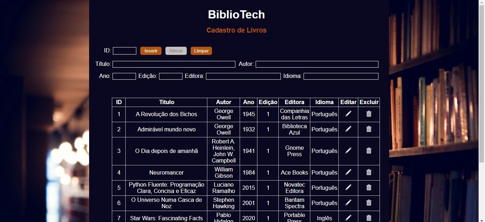

# Regras projeto
* Utilizando como exemplo, a página de cadastro de produto desenvolvida em aula, crie um projeto
de cadastramento, com as funcionalidades de inserção, seleção,
atualização e exclusão. 

# Requisitos
* Banco de dados relacional (PostgreSQL)
* ASP.NET
* HTML5
* CSS

# Tema escolhido
* Cadastro de livros

